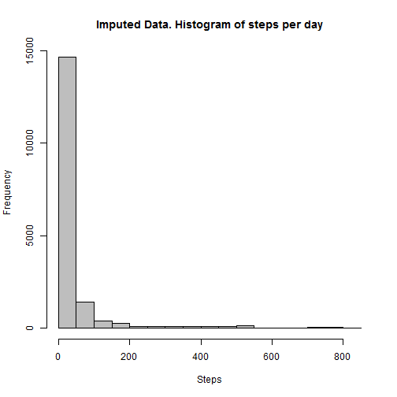

# Reproducible Research: Peer Assessment 1

## Preparation
First let's set the locale to English then load the lattice plotting library.

```r
Sys.setlocale("LC_TIME", "English")
```

```
## [1] "English_United States.1252"
```

```r

library(lattice)
```

```
## Warning: package 'lattice' was built under R version 3.0.3
```


## Loading and preprocessing the data
Now we unzip the data and read it.

```r
unzip("activity.zip")

data <- read.csv("activity.csv", stringsAsFactors = FALSE)
```


## What is mean total number of steps taken per day?
That is given by

```r
sd <- aggregate(steps ~ date, data, "sum")

hist(sd$steps, col = "grey", xlab = "steps", main = "Steps")
```

 

With Mean

```r
mean(sd$steps)
```

```
## [1] 10766
```

and Median

```r
median(sd$steps)
```

```
## [1] 10765
```


## What is the average daily activity pattern?

```r
si <- aggregate(steps ~ interval, data, "mean")

plot(si, type = "l", main = "Average Steps by Interval", xlab = "Interval", 
    ylab = "Step Avg.")
```

 

The interval with the greatest average number of steps is

```r
si[which(si$steps == max(si$steps)), "interval"]
```

```
## [1] 835
```


With

```r
si[which(si$steps == max(si$steps)), "steps"]
```

```
## [1] 206.2
```

steps on average
## Imputing missing values
Total number of missing values is

```r
sum(!complete.cases(data))
```

```
## [1] 2304
```


We'll replace the missing values with the mean of each observation's interval, creating a copy of our data first.

```r
newData <- data
newData[is.na(newData), "steps"] <- si[match(newData[is.na(newData), "interval"], 
    si$interval), "steps"]
hist(newData$steps, col = "grey", main = "Imputed Data. Histogram of steps per day", 
    xlab = "Steps")
```

 

With Mean

```r
mean(newData$steps)
```

```
## [1] 37.38
```

And Median

```r
median(newData$steps)
```

```
## [1] 0
```


No difference , as expected, since we're replacing each NA with the mean.
## Are there differences in activity patterns between weekdays and weekends?

```r
newData$day <- as.factor(weekdays(strptime(newData$date, "%Y-%m-%d")))

newData$week <- as.factor(sapply(newData$day, function(d) if (d == "Saturday" || 
    d == "Sunday") "weekend" else "weekday"))

summary <- aggregate(steps ~ interval + week, newData, "mean")

xyplot(steps ~ interval | week, summary, layout = c(1, 2), type = "l")
```

 

Clearly, yes.
